# Supabase復旧・移行手順書 (プロジェクト停止時のリカバリーガイド)

本手順書は、無料プランのSupabaseプロジェクトが一定期間（90日以上）放置され、ダッシュボードから復元できなくなった状態から、新しいプロジェクトへデータおよび設定を完全移行・復旧した際の手順をまとめたものです。

---

## 1. 復旧が必要になる背景
Supabaseの無料プランでは、**7日間アクティビティ（APIリクエストやDB接続）がない場合、自動的にプロジェクトが一時停止（Pause）**されます。
さらに、一時停止から**90日が経過するとダッシュボードからの復元（Restore）ができなくなり**、データベースのバックアップデータ（SQL等）と画像等のストレージデータのみがダウンロード可能な状態になります。

アプリを再稼働させるには、**新しいプロジェクトを作成し、データを移行（リストア）する**必要があります。

---

## 2. 復旧・移行の全体フロー

```mermaid
graph TD
    A[停止した旧プロジェクト] --> B(SQLバックアップのダウンロード)
    A --> C(Storageオブジェクトのダウンロード)
    B --> D[新しいSupabaseプロジェクト作成]
    C --> E[Storageバケット作成 & 画像アップロード]
    D --> F[psqlコマンドによるDB復元]
    F --> G[SQLによる画像URLドメインの一括置換]
    E --> G
    G --> H[Google OAuthログインの再設定]
    H --> I[Vercel/GitHub/ローカル環境の環境変数更新]
```



---

## 3. 詳細手順

### ステップ 1: 旧プロジェクトからのデータダウンロード
1. [Supabase Dashboard](https://supabase.com/dashboard) にログインし、停止した古いプロジェクトを開きます。
2. **「Backups」**セクションから、データベースのバックアップファイル（`.backup` または `.sql`）をダウンロードします。
3. **「Storage」**セクションから、ストレージオブジェクト（画像ファイル群）をダウンロードします。

### ステップ 2: 新しいSupabaseプロジェクトの作成
1. Supabaseダッシュボードで **「New Project」** をクリックします。
2. プロジェクト名（例: `camp-record-new`）を入力し、データベースのパスワードを設定して作成します。
3. プロジェクトがアクティブになるまで数分待ちます。

### ステップ 3: データベース（SQL）の復元
ダウンロードしたSQLファイルには、PostgreSQLのコマンドラインツール（`psql`）専用のメタコマンド（`\` で始まる行）やシステム定義のトリガーが含まれているため、**ブラウザ上の SQL Editor から実行すると構文エラーになります。**
必ず以下の手順で、パソコンのターミナルから復元を行います。

1. macのターミナルを開き、PostgreSQLツールをインストールします。
   ```bash
   brew install postgresql
   ```
2. 新しいSupabaseの **Settings** > **Database** > **Connection info** から **Host**（`db.xxxxxx.supabase.co`）をコピーします。
3. 以下のコマンドを実行して復元します。
   ```bash
   psql -h <新しいHost名> -U postgres -d postgres -f <ダウンロードしたSQLファイルのパス>
   ```
   *(※パスワードを求められるので、新プロジェクト作成時に設定した「データベースパスワード」を入力します。)*
   *(※GraphQLやCronに関連するいくつかのシステムエラー（`Non-superuser owned event trigger...`）が表示されますが、これらはSupabase側が自動管理している領域のため、無視して問題ありません。)*

### ステップ 4: ストレージの復元（画像ファイルの配置）
1. 新しいSupabaseの **Storage** を開き、**「New Bucket」** から bucket 名 `campsite_images` を作成します。
2. 公開設定を **「Public bucket」** に変更して保存します。
3. ダウンロードしたストレージバックアップから、ユーザーID名（英数字の羅列）のフォルダごと、`campsite_images` バケットの中にドラッグ＆ドロップしてアップロードします。

### ステップ 5: データベース内の画像URLドメインの置換
データベースに保存されている画像URLが古いプロジェクトドメイン（例: `https://hvydpbxzctycjzsdlkyu.supabase.co`）のままになっているため、これを新しいプロジェクトのドメインに書き換えます。

1. 新しいSupabaseの **SQL Editor** で「New query」を開きます。
2. 以下のSQLを実行します（ドメイン部分は実際の新旧プロジェクトURLに置き換えてください）。
   ```sql
   UPDATE campsites
   SET image_urls = array(
     SELECT replace(url, 'https://<古いプロジェクトID>.supabase.co', 'https://<新しいプロジェクトID>.supabase.co')
     FROM unnest(image_urls) AS url
   );
   ```

### ステップ 6: Google OAuth（ソーシャルログイン）の再設定
1. 新しいSupabaseの **Authentication** > **Providers** > **Google** を有効にします。
2. 表示されている **「Redirect URI」** をコピーします。
3. [Google Cloud Console](https://console.cloud.google.com/) の「APIとサービス」 > 「認証情報」から、該当するOAuth 2.0 クライアントの設定を開き、「承認済みのリダイレクトURI」にコピーした新しいURLを追加します。
4. Googleの「クライアントID」と「クライアントシークレット」を、SupabaseのGoogleプロバイダ設定に入力して「Save」します。
5. Supabaseの **Authentication** > **URL Configuration** を開き、以下を設定します。
   * **Site URL:** Vercelの本番環境URL（例: `https://camp-record.vercel.app`）
   * **Redirect URLs:** `http://localhost:3000/**` （ローカル用）および `https://*.vercel.app/**` （本番/プレビュー用）

### ステップ 7: 各環境の環境変数更新
新しいSupabaseの接続URL (`NEXT_PUBLIC_SUPABASE_URL`) と Anon Key (`NEXT_PUBLIC_SUPABASE_ANON_KEY`) を、以下の3箇所で更新します。

1. **ローカル環境:**
   プロジェクト内の `.env.local` ファイルの値を書き換えます。
2. **Vercel (本番環境):**
   Vercelプロジェクトの **Settings** > **Environment Variables** から値を更新し、**Deployments** タブから最新コミットを **Redeploy** します。
3. **GitHub Secrets (自動テスト用):**
   GitHubのレポジトリ設定 **Settings** > **Secrets and variables** > **Actions** にあるシークレット値を更新します。

---

## 4. 今後の自動停止を防ぐための予防策 (Keep-Alive)
今回の復旧に伴い、リポジトリに `.github/workflows/keep-alive.yml` というGitHub Actionsのワークフローを導入しました。

* **動作内容:**
  毎週日曜日と木曜日の週2回、自動的にGitHub Actionsが立ち上がり、SupabaseのREST API（`campsites`テーブル）に対して軽量な接続クエリを実行します。
* **メリット:**
  これによりアクティビティが定期的に発生するため、アプリへのアクセスがない期間が続いても、無料プランのSupabaseプロジェクトが自動停止（Pause）されるのを防ぐことができます。
