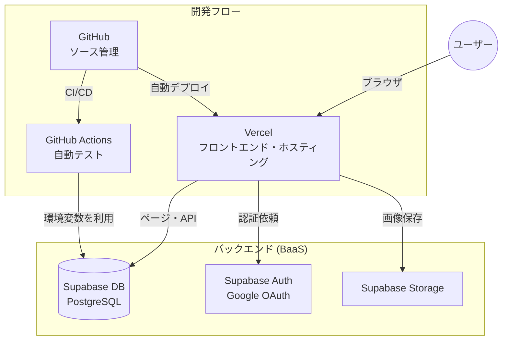

# インフラ・サービス構成 (Services)

本プロジェクトでは、デプロイからデータベース、認証、ストレージまで、全て無料枠の範囲内でサービスを組み合わせて構築しています。

## サービス構成図 (Service Correlation)

各サービスがどのように連携しているかを以下の図に示します。

## 各サービスの役割と無料枠の制限事項（2026年1月時点）

| サービス | 役割 | 主な無料枠の制限事項 |
| :--- | :--- | :--- |
| **GitHub** | ソースコード管理・CI/CD | ・Publicリポジトリは無制限 ・プライベートリポジトリのActionsは月 2,000分まで ・2026年よりホストランナーの価格が改定され、より効率的な運用が可能 |
| **Vercel** | Webサイトの公開 (ホスティング) | ・Hobbyプラン: 非営利・個人利用限定 ・Fast Data Transfer 100GB/月 ・ビルド実行時間 6,000分/月 ・1日あたり最大 100デプロイ |
| **Supabase** | データベース・認証・ストレージ | ・データベース容量 500MB / ストレージ 1GB ・帯域幅 (Egress) 5GB/月 ・月間アクティブユーザー (MAU) 50,000人まで ・1週間以上アクセスがないとポーズ(停止)される |

## 技術的なポイント
- **環境変数の管理**: Supabaseの接続キーなどは Vercel と GitHub Actions 両方に個別に設定することで、漏洩を防ぎつつ安全に連携させています。
- **デプロイの自動化**: GitHubにコードを `push` するだけで、自動的にVercelへの反映と GitHub Actions によるテストが走る仕組みになっています。
